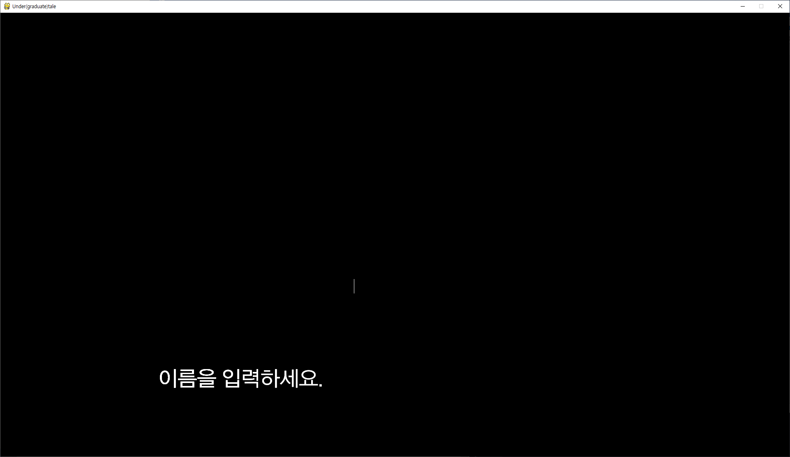

# Under-graduation-tale
기존의 인디게임 Undertale을 패러디한 산성비 타자 게임
- 하늘에서 쏟아지는 과제를 재빠르게 수행하는 학부생의 모습을 표현한 게임입니다.
- 배경 음악, 효과음 등은 저작권 문제에 의해 업로드하지 않았습니다.

### 사용한 오픈소스
  - 텍스트 인풋 박스(https://github.com/Nearoo/pygame-text-input)
  
### 사용한 라이브러리
  - pygame
    - 화면 출력, 색상 설정 등을 위해 사용
  - os
    - 불러올 파일이 존재하는지 확인을 위해 사용
  - pickle
    - 저장, 불러오기 기능 구현에 사용

## 실행 화면
### 인트로 화면

### 게임 시작 전

### 이름 설정(입력받은 이름에 대한 저장 데이터가 있을 경우 불러오기)

### 게임 시작 후 화면

### Game Over

